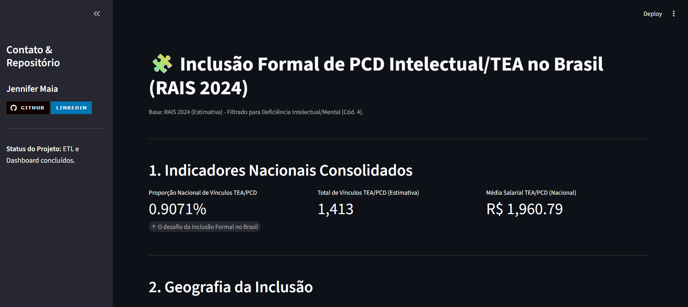

# 💜 TEA Data Lakehouse — Análise de Inclusão no Mercado Formal (RAIS 2024)

<p align="center">
  
</p>

Este projeto implementa uma arquitetura completa de **Data Lakehouse** no **Databricks**, culminando em um **dashboard analítico (Streamlit)** voltado à análise da **inclusão de pessoas com Transtorno do Espectro Autista (TEA)** e **Deficiência Intelectual** no mercado de trabalho formal brasileiro.

---

## 💡 Propósito e Impacto Social

O projeto nasce da minha vivência como pessoa autista e da percepção dos desafios estruturais que a neurodivergência enfrenta no mercado de trabalho.

Muitas das habilidades associadas ao TEA — como foco, consistência e raciocínio lógico — são valiosas, mas frequentemente invisibilizadas por ambientes desenhados para perfis neurotípicos.
A proposta aqui é **usar dados para transformar essa realidade**, gerando visibilidade e impulsionando políticas de inclusão baseadas em evidências.

### 📊 Valor Gerado pela Análise

Os resultados extraídos da camada GOLD traduzem uma questão social em métricas acionáveis:

* **Visibilidade do Desafio:** indicadores como a **Proporção Nacional de Vínculos TEA/PCD (0,9071%)** estabelecem uma linha de base para ações de inclusão.
* **Identificação de Tendências:** a distribuição por UF, escolaridade e ocupação mostra onde há mais concentração de vínculos e onde há lacunas.
* **Suporte à Decisão:** os dados consolidados permitem análises estratégicas para políticas públicas e programas de diversidade.

> ⚠️ **Importante:** os números apresentados derivam de uma **amostra reduzida dos microdados RAIS** (extraída via BigQuery).
> Portanto, os resultados representam **tendências indicativas**, não valores oficiais. O objetivo é demonstrar o pipeline e as análises possíveis a partir de um recorte realista.

---

## 🏗️ Stack Tecnológico e Arquitetura

<p align="center">
  
</p>

### Arquitetura (Lakehouse Pattern)

O pipeline segue o padrão **Medallion Architecture** (Bronze → Silver → Gold), garantindo qualidade, rastreabilidade e reuso dos dados.

| Camada             | Descrição                                          | Ferramentas                   |
| :----------------- | :------------------------------------------------- | :---------------------------- |
| **ETL Pipeline**   | Transformações e regras de qualidade declarativas. | **Delta Live Tables (DLT)**   |
| **Data Lakehouse** | Armazenamento e gerenciamento em formato Delta.    | **Databricks**                |
| **Visualização**   | Painel interativo e storytelling de dados.         | **Streamlit + Plotly**        |
| **Versionamento**  | Controle de versão e deploy.                       | **Git / GitHub**              |
| **Ambiente Local** | Gerenciamento de dependências e reprodutibilidade. | **Poetry / requirements.txt** |

**Por que Databricks + DLT?**
O **Delta Live Tables** foi escolhido para explorar o ecossistema Databricks em profundidade — oferecendo pipelines declarativos com *data quality expectations* e controle de *state*, fundamentais em soluções escaláveis.

---

## 🧩 Fontes de Dados

* **RAIS 2024 (Estimativa)** — Principal fonte de vínculos formais no Brasil.
* **IBGE / CBO (via BigQuery)** — Enriquecimento com ocupações e classificações geográficas.
* **Dicionários auxiliares (RAIS e CBO)** — Normalização de descrições e categorias.

---

## 🚧 Desafios e Lições Aprendidas

1. **Mesclagem de Fontes:** garantir a integridade das chaves (RAIS + CBO) e harmonização das descrições.
2. **Gerenciamento de Dependências:** uso do **Poetry** para estabilizar conflitos entre `databricks-sql-connector` e `pandas`.
3. **Conector Databricks → Streamlit:** adaptação do código para `cursor.fetchall()` + `pd.DataFrame()`, substituindo métodos não suportados.
4. **Escalabilidade:** o uso de DLT simplificou o monitoramento de *data lineage* e automação da carga incremental.

---

## ⚙️ Como Reproduzir

### 1. Clone o repositório

```bash
git clone https://github.com/Jennifer-Maia/Projeto-TEA-Databricks.git
cd Projeto-TEA-Databricks
```

### 2. Crie o ambiente

```bash
poetry install
# ou
pip install -r requirements.txt
```

### 3. Configure variáveis de conexão

Crie um arquivo `.env` (ou use variáveis de ambiente) com:

```
DATABRICKS_SERVER_HOST=https://<workspace-url>
DATABRICKS_HTTP_PATH=/sql/warehouses/<id>
DATABRICKS_TOKEN=<seu-token>
```

### 4. Execute o Streamlit

```bash
streamlit run app.py
```

### 5. (Opcional) Rode no Databricks

Execute os notebooks de **ingestão** e **transformação** para gerar as tabelas Bronze → Gold no seu workspace.

---

## 📈 Resultados (Versão de Demonstração)

| Indicador                       | Valor (amostra) |
| :------------------------------ | --------------: |
| **Proporção Nacional TEA/PCD**  |         0,9071% |
| **Total de Vínculos (amostra)** |           1.413 |
| **Média Salarial (amostra)**    |     R$ 1.960,79 |

> *Os valores acima são ilustrativos, baseados no subconjunto usado para desenvolvimento e demonstração do pipeline.*

---

## 🚀 Próximos Passos

* Adicionar métricas de **turnover** e **tempo médio de permanência**.
* Criar modelo de **Machine Learning** preditivo de inclusão/retenção.
* Implementar um **Agente Analítico LLM** para consultas em linguagem natural.

---

## 👩‍💻 Autor

**Jennifer Maia** — *Analytics Engineer*
Apaixonada por dados, inclusão e arquitetura de soluções que conectam tecnologia e propósito.
[LinkedIn](https://www.linkedin.com/in/jennifer-n-maia/) • [GitHub](https://github.com/Jennifer-Maia)

---
