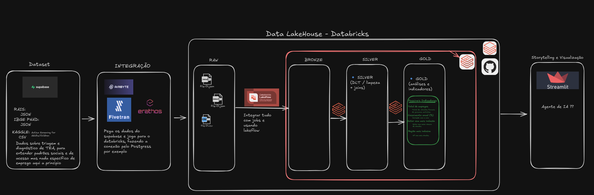

# 🧩 Projeto TEA Data Lakehouse: Análise de Inclusão Formal (RAIS 2024)

Este projeto implementa uma arquitetura completa de Data Lakehouse no Databricks, culminando em um dashboard analítico (Streamlit) focado na análise da inclusão de pessoas com Transtorno do Espectro Autista (TEA) e Deficiência Intelectual no mercado de trabalho formal brasileiro.

---

## 💜 Propósito e Impacto Social

O projeto é guiado pela minha experiência pessoal como pessoa autista e pela percepção dos desafios estruturais que a neurodivergência enfrenta no mercado.

Muitas habilidades inerentes ao TEA (como foco em detalhes, consistência e lógica) são valiosas, mas a rigidez do mercado neurotípico pode mascarar este potencial. **O objetivo é fornecer dados claros** para mover a discussão de "somos capazes" para "como criar um ambiente de trabalho mais inclusivo, adaptável e acolhedor".

### Valor Gerado pela Análise de Dados:

Os resultados extraídos da camada GOLD transformam uma questão social complexa em métricas acionáveis:

* **Visibilidade do Desafio:** Os indicadores chave (como a **Proporção Nacional de Vínculos TEA/PCD** de **0.9071%**) estabelecem um ponto de partida claro para qualquer iniciativa de inclusão.
* **Identificação de Tendências:** A análise geográfica e a distribuição salarial (Média Salarial de **R$ 1.960,79**) e por ocupação mostram onde o esforço de inclusão está concentrado e quais áreas demandam maior investimento.
* **Dados para Decisão:** O projeto fornece a base de dados limpa e agregada, essencial para que profissionais tomem decisões informadas sobre políticas de diversidade e investimento em qualificação.

---

## 🛠️ Stack Tecnológico e Arquitetura

  

Este projeto demonstra proficiência na construção de um pipeline de dados ponta a ponta, usando as seguintes ferramentas:

### Arquitetura (Lakehouse Pattern)

O pipeline segue a **Medallion Architecture** (Bronze, Silver, Gold), garantindo qualidade, linhagem e reusabilidade dos dados.

| Camada | Descrição | Ferramentas |
| :--- | :--- | :--- |
| **ETL Pipeline** | Construção das transformações e regras de qualidade. | **Delta Live Tables (DLT)** (em substituição ao dbt original) |
| **Data Lakehouse** | Armazenamento e gerenciamento dos dados no formato aberto Delta Lake. | **Databricks** |
| **Visualização** | Consumo e apresentação dos KPIs e gráficos. | **Streamlit** |
| **Versionamento** | Gerenciamento de código e fluxo de trabalho. | **Git / GitHub** |
| **Ambiente Local** | Gerenciamento robusto de dependências Python. | **Poetry** |

**Por que Databricks e DLT?**
O uso do Delta Live Tables foi uma decisão estratégica para me especializar no ecossistema Databricks. O DLT oferece uma abordagem declarativa para ETL, simplificando a aplicação de expectativas de qualidade e o gerenciamento do *state* do Delta Lake, algo crucial em ambientes de produção.

### Fontes de Dados

* **RAIS 2024 (Estimativa):** Principal fonte de dados sobre vínculos formais de trabalho no Brasil.
* **IBGE (Diversos Datasets):** Utilizado para enriquecimento geográfico e classificações (CBO).
* **Kaggle e Outras Amostras:** Utilizado para fornecer dados complementares e contexto à análise de inclusão.

---

## 🚧 Desafios e Lições Aprendidas

A execução do projeto apresentou desafios técnicos importantes que foram superados:

1.  **Aquisição e Mesclagem de Dados:** A complexidade de mesclar fontes distintas (RAIS, IBGE) para criar um *dataset* coerente sobre TEA/PCD, garantindo a integridade dos IDs e classificações.
2.  **Gerenciamento de Dependências:** O **Poetry** foi essencial para resolver o conflito entre o `databricks-sql-connector` e os rígidos requisitos de versão do `pandas` de forma estável e reproduzível.
3.  **Adaptação de API do Conector:** O erro `fetchall_pandas` (atributo não existente) exigiu uma refatoração na camada de conexão do Streamlit, mostrando a necessidade de adaptar o código ao comportamento específico do driver SQL do Databricks (`cursor.fetchall()` + `pd.DataFrame()`).

---

## 🚀 Próximos Passos

O roadmap para o projeto inclui as seguintes expansões, transformando-o em uma plataforma de análise preditiva:

* **Expansão de KPIs na GOLD:** Adicionar métricas como *turnover* e *tempo médio de permanência* para avaliar a retenção.
* **Modelo de Machine Learning:** Desenvolver um modelo para prever a probabilidade de sucesso/permanência de um profissional TEA em diferentes setores, com base em *features* como escolaridade e ocupação.
* **Agente de I.A. Analítico:** Implementar um Agente LLM para permitir que o usuário faça perguntas complexas em linguagem natural, obtendo *insights* diretos dos DataFrames (Visualização Aumentada).